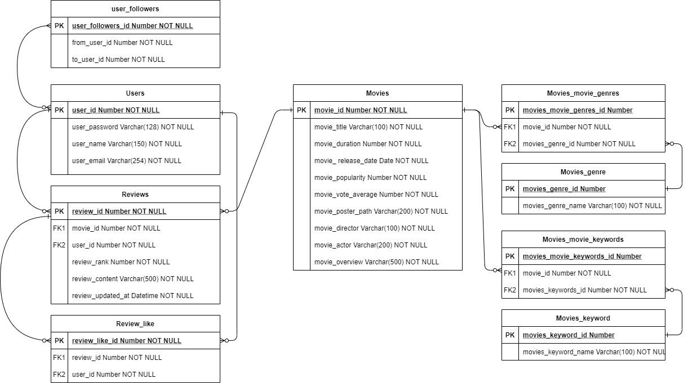

## 1. 팀원 정보 및 업무 분담 내역

---

- 고우영
  - Vue.js, CSS 및 핵심적인 UI구현
- 권연주
  - DJango API Server를 활용한 API 구현

### 

## 2. 목표 서비스

- 명대사 기반 영화 추천 제공
  - 메인 화면에서 사용자가 선택한 대사를 기반으로 추천을 구현함

- 영화 목록 제공
  - Pagination과 검색을 포함한 영화목록을 구현함

- 영화 상세정보에서 평점과 리뷰를 생성하고 수정, 삭제
  - 영화를 클릭하면 나타나는 모달창에서 평점과 리뷰 생성, 수정, 삭제가 가능하도록 구현함

- 사용자 프로필 조회 가능
  - 본인과 다른 사용자의 프로필을 구현할 수 있도록 구현함
- Follow 기능
  - 프로필 내에서 Follow를 하고 팔로잉, 팔로우 목록을 확인할 수 있도록 구현함

- 회원가입, 로그인
  - Django JWT를 사용하여 회원가입, 로그인을 구현

## 3. 데이터베이스 모델링(ERD)

- 유저, 영화, 리뷰를 포함한 총 9개의 테이블로 구성

## 4. 핵심 기능

- 메인 화면에서 명대사 기반 추천 알고리즘을 제공
- 슬라이더, 네온, 페이지네이션 등을 이용해 직관적인 UI 구현
- Vue Component를 통해 재사용 할 수 있는 웹 어플리케이션 제작

## 5. 느낀점

- 고우영

  Vue의 컴포넌트를 구성하는데 많은 어려움이 있었습니다. 초기에 컴포넌트 구조를 고려하는데 생각보다 시간이 걸렸지만 여러 페이지를 구현하며 Vue의 구조에 대해 이해할 수 있었습니다. Vuex의 사용 방법에 미숙해 이번 프로젝트에서는 제대로 응용하지 못했지만 다음 프로젝트에서는 꼭 구현해보고 싶습니다. 저희 팀은 최대한 사용자가 보기에 직관적이고 편리한 UI를 구현하는데 초점을 맞췄는데 목표에 부합하게 구현한 것 같아 만족스럽습니다.

- 권연주

  SPA를 통해  페이지 갱신 없이 웹어플리케이션을 구현하는 것이 굉장히 어렵다고 느꼈습니다. Front-end에서 할 일이 굉장히 많아 서버 구현 후에 Front-end도 함께 작업하게 되었는데  생소했던 Vue를 공부할 수 있는 좋은 기회였습니다. 서버에서 효율적으로 알고리즘을 제공해야할 필요성을 느꼈으며 다음에는 더 탄탄한 설계를 하고 싶습니다.